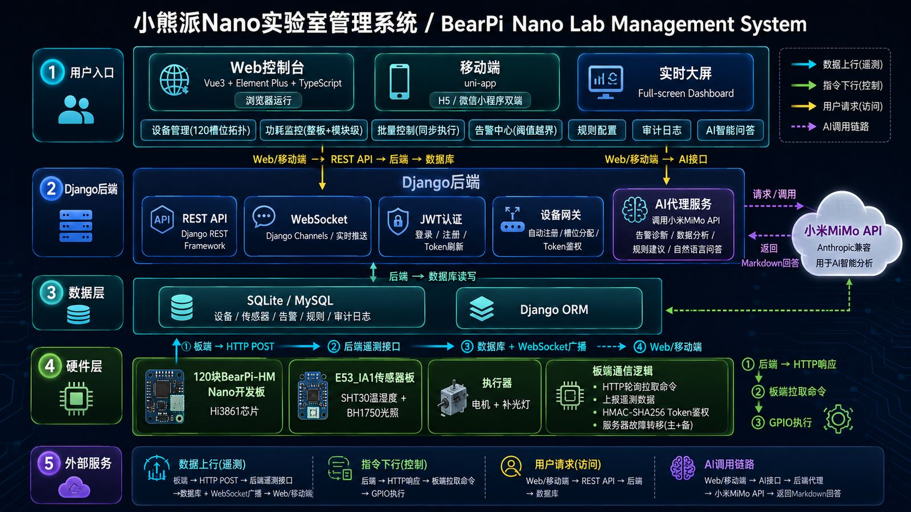

<div align="center">

<h1>BearPi-Nano-Lab</h1>

<h3>面向嵌入式实验室的BearPi-HMNanoIoT设备管理平台</h3>

<p>从开发板遥测采集、设备自动注册、实时告警、批量控制到Web控制台和移动端的一体化实验系统。</p>

[](backend/requirements.txt)
[](backend/backend/settings.py)
[](frontend/package.json)
[](frontend/package.json)
[](mobile/package.json)
[](LICENSE)

<p>
<a href="#快速开始">快速开始</a>·
<a href="#系统架构">系统架构</a>·
<a href="#接口速览">接口速览</a>·
<a href="#固件接入">固件接入</a>·
<a href="#联系作者">联系作者</a>
</p>

</div>

---

## 项目定位

BearPiNanoLab是一套面向课程实验、嵌入式实训和IoT原型验证的全栈开源项目。它把BearPi-HMNano开发板、E53_IA1传感器、DjangoRESTAPI、DjangoChannels、Vue3控制台和uni-app移动端连接成完整链路，让设备可以自动接入实验室平台，并把温度、湿度、光照、电机状态、电压、电流、功耗等数据实时呈现出来。

这个仓库不是单纯的前端模板或后端Demo，而是包含四个可独立阅读、可组合运行的部分：

|模块|目录|说明|
|---|---|---|
|后端服务|`backend/`|Django4.2、DRF、SimpleJWT、Channels、MySQL、Redis可选|
|Web控制台|`frontend/`|Vue3、TypeScript、ElementPlus、Pinia、ECharts、Vite|
|移动端|`mobile/`|uni-app、Vue3、TypeScript、WotDesignUni，支持H5和微信小程序构建|
|嵌入式固件|`firmware/`|BearPi-HMNano/OpenHarmony/Hi3861示例，主固件走HTTP上报和指令拉取|

## 功能亮点

|能力|已经实现的内容|
|---|---|
|设备接入|开发板按SN自动注册，先接入先占位，设备自动分配1-120号槽位|
|实时遥测|HTTP上报入库，WebSocket广播到Web端，支持未知设备上报后自动刷新列表|
|数据指标|温度、湿度、光照、电机、工作电压、工作电流、瞬时功耗、模块功耗、采样来源|
|告警规则|传感器上下限在线配置，越界自动创建告警，恢复后自动关闭历史告警|
|远程控制|支持重启、升级、参数设置，电机/补光灯可切换auto/on/off|
|批量任务|支持面向全部、在线、指定设备的同步下发，记录batchId、executeAt、进度和失败重试|
|权限体系|admin、experimenter、viewer三类角色；审计日志和用户管理仅管理员可见|
|实验室视图|总览、实时大屏、120槽位拓扑、功耗监控、任务中心、历史查询、规则配置|
|安全设计|JWT用户认证、登录/注册/刷新限流、每板HMAC-SHA256Token、CSV/Excel公式注入防护|
|AI智能分析|告警诊断、数据趋势分析、阈值规则建议、自然语言数据查询，调用小米MiMo API|
|部署入口|Django可直接托管前端dist，前端提供Nginx配置和Dockerfile|

## 系统架构



## 技术栈

|层级|关键技术|
|---|---|
|后端|Django4.2、DjangoRESTFramework、SimpleJWT、DjangoChannels、Daphne、PyMySQL、channels-redis|
|数据库|MySQL8，默认库名`bearpi_lab`|
|实时通道|`/ws/realtime?token=<JWT_ACCESS_TOKEN>`，消息类型包含`sensor.point`和`alarm.event`|
|Web端|Vue3、TypeScript、Vite6、ElementPlus、Pinia、ECharts、lucide-vue-next|
|移动端|uni-app、Vue3、TypeScript、Pinia、WotDesignUni|
|固件|OpenHarmony/Hi3861、BearPi-HMNano、E53_IA1、lwIPSocket、HTTP/1.1、内置HMAC-SHA256|
|AI|小米MiMo API（Anthropic兼容），后端代理转发，支持告警诊断/数据分析/规则建议/自然语言查询|

## 快速开始

### 1.准备环境

|依赖|建议版本|用途|
|---|---|---|
|Python|3.9+|运行Django后端|
|Node.js|18+|运行Web端和移动端构建|
|MySQL|8.0+|业务数据存储|
|Redis|6.0+|可选，用于生产级Channels广播|
|DevEcoDeviceTool|按OpenHarmonySDK要求|编译和烧录BearPi-HMNano固件|

### 2.启动后端

```bash
cd backend
python -m venv venv
venv\Scripts\activate
pip install -r requirements.txt
copy .env.example .env
python manage.py migrate
python manage.py seed_demo
python manage.py runserver 0.0.0.0:8000
```

启动后访问：

```text
http://127.0.0.1:8000/health
```

默认演示账号只建议本地开发使用：

|账号|密码|角色|
|---|---|---|
|`admin`|`admin123`|管理员|
|`exp`|`admin123`|实验员|
|`lab`|`admin123`|实验员|
|`viewer`|`admin123`|只读用户|

> 生产环境不要使用默认密钥、默认密码或默认Token。`seed_demo`在`DEBUG=false`时默认拒绝创建弱密码账号，确需执行必须显式传入`--allow-prod`和强密码。

### 3.启动Web控制台

```bash
cd frontend
npm install
npm run dev
```

默认开发端口：

```text
http://127.0.0.1:5174
```

如果希望前端直连指定后端，在`frontend/.env`中配置：

```env
VITE_API_BASE=http://127.0.0.1:8000/api/v1
VITE_WS_BASE=ws://127.0.0.1:8000/ws/realtime
VITE_USE_MOCK=false
```

### 4.启动移动端

```bash
cd mobile
npm install
npm run dev:h5
```

微信小程序开发构建：

```bash
npm run dev:mp-weixin
```

### 5.构建生产前端

```bash
cd frontend
npm run build
```

仓库当前没有提供根目录`docker-compose.yml`。如果需要容器化前端，可直接复用`frontend/Dockerfile`和`frontend/nginx.conf`；后端建议以Daphne/ASGI方式部署，并配置MySQL、可选Redis和反向代理的WebSocket升级头。

## 固件接入

主固件位于：

```text
firmware/my_bearpi_lab_http
```

该固件循环执行四件事：

1. 读取E53_IA1传感器和功耗估算/采样值。
2. 向后端`/api/v1/ingest/telemetry`上报遥测。
3. 从`/api/v1/device/commands/pull`拉取待执行命令。
4. 执行电机/补光灯控制后向`/api/v1/device/commands/ack`回执。

刷机前编辑：

```text
firmware/my_bearpi_lab_http/include/bearpi_lab_config.h
```

关键配置：

```c
#define BEARPI_WIFI_SSID      "YOUR_WIFI_SSID"
#define BEARPI_WIFI_PASSWORD  "YOUR_WIFI_PASSWORD"
#define BEARPI_SERVER_HOST    "YOUR_SERVER_IP"
#define BEARPI_SERVER_HOST_FALLBACK "192.168.137.1"
#define BEARPI_SERVER_PORT    8000
#define BEARPI_DEVICE_SN      "BEARPI-NANO-A002"
#define BEARPI_DEVICE_TOKEN_SECRET "replace-me-device-token-secret"
#define BEARPI_REPORT_INTERVAL_MS  2000
```

设备Token规则：

```text
X-Device-Token=HMAC-SHA256(DEVICE_TOKEN_SECRET,"bearpi-device:"+大写SN)
```

也可以把预计算Token写入`BEARPI_DEVICE_TOKEN`，为空时固件会在运行时按SN和密钥推导。

固件默认上报：

```text
temp/hum/light/motor/voltage/current/power
voltage_sampled/current_sampled/power_sampled
power_mcu/power_wifi/power_sensor/power_motor/power_light
```

BearPi-HMNano无法仅靠软件读取真实整板电流，因此默认功耗为估算值。接入ADC采样电路后，可启用：

```c
#define BEARPI_VOLTAGE_ADC_ENABLE  1
#define BEARPI_CURRENT_ADC_ENABLE  1
```

更多固件细节见[firmware/my_bearpi_lab_http/README.md](firmware/my_bearpi_lab_http/README.md)。

## 接口速览

### 用户与权限

|方法|路径|说明|
|---|---|---|
|POST|`/api/v1/auth/login`|登录并返回JWT|
|POST|`/api/v1/auth/register`|注册只读账号|
|POST|`/api/v1/auth/refresh`|刷新AccessToken|
|GET|`/api/v1/auth/users`|管理员查看用户|
|POST|`/api/v1/auth/users/<user_id>/role`|管理员调整角色|

### 设备与命令

|方法|路径|说明|
|---|---|---|
|GET|`/api/v1/devices`|设备列表，默认只返回活跃设备|
|GET|`/api/v1/devices?include_inactive=true`|包含离线/过期设备|
|GET|`/api/v1/devices/<id>`|设备详情和传感器列表|
|GET|`/api/v1/devices/<id>/commands`|设备命令历史|
|POST|`/api/v1/devices/<id>/commands`|向单设备下发命令|
|POST|`/api/v1/devices/bulk-commands`|批量下发电机/补光灯同步控制|
|GET|`/api/v1/devices/bulk-tasks`|批量任务列表|
|POST|`/api/v1/devices/bulk-tasks/<batch_id>/retry`|重试失败板卡|
|POST|`/api/v1/device/commands/pull`|设备侧拉取命令|
|POST|`/api/v1/device/commands/ack`|设备侧命令回执|

### 遥测、告警、规则、审计

|方法|路径|说明|
|---|---|---|
|POST|`/api/v1/ingest/telemetry`|设备侧遥测上报|
|GET|`/api/v1/sensors/<sensor_id>/history`|历史曲线，支持`1m/5m/1h/1d`聚合|
|POST|`/api/v1/simulate/realtime`|开发模式模拟实时数据|
|GET|`/api/v1/alarms`|告警列表|
|POST|`/api/v1/alarms/<alarm_id>/ack`|确认告警|
|GET|`/api/v1/rules`|传感器阈值规则|
|PUT/PATCH|`/api/v1/rules/<sensor_id>`|更新上下限|
|GET|`/api/v1/audit-logs`|管理员查看审计日志|

### AI智能分析

|方法|路径|说明|
|---|---|---|
|POST|`/api/v1/ai/chat`|AI分析（告警诊断/数据分析/规则建议），实验员以上可用|
|POST|`/api/v1/ai/query`|AI自然语言问答，自动查询实验室数据上下文，所有登录用户可用|

## Web控制台页面

|路由|页面|
|---|---|
|`/dashboard`|异常优先总览、在线率、批量控制入口、AI智能问答|
|`/screen`|实验室实时大屏|
|`/topology`|120槽位拓扑|
|`/power`|功耗监控|
|`/tasks`|批量任务中心|
|`/devices/:deviceId`|板卡详情|
|`/devices/:deviceId/sensors/:sensorId/realtime`|传感器实时曲线|
|`/devices/:deviceId/sensors/:sensorId/history`|历史数据查询和导出|
|`/alarms`|告警中心|
|`/rules`|规则配置|
|`/audit`|审计日志，管理员可见|
|`/users`|用户权限，管理员可见|

## 项目结构

```text
BearPi-Nano-Lab/
├──backend/
│  ├──apps/
│  │  ├──accounts/      #登录、注册、角色
│  │  ├──alarms/        #告警列表和确认
│  │  ├──audit/         #审计日志
│  │  ├──cloud/         #云端设备状态模型
│  │  ├──common/        #设备解析、自动注册、Token校验
│  │  ├──devices/       #设备、传感器、命令、批量任务、规则
│  │  ├──telemetry/     #遥测上报、历史聚合、WebSocket广播
│  │  └──ai/            #AI智能分析代理，调用小米MiMo API
│  ├──backend/          #Django配置、ASGI、URL入口
│  └──requirements.txt
├──frontend/
│  ├──src/api/          #RESTAPI和WebSocket客户端
│  ├──src/components/   #控制台组件
│  ├──src/stores/       #Pinia状态
│  ├──src/views/        #业务页面
│  └──package.json
├──mobile/
│  ├──src/api/
│  ├──src/pages/
│  ├──src/stores/
│  └──package.json
├──firmware/
│  ├──my_bearpi_lab_http/ #主HTTP固件
│  ├──my_e53_ia1/         #E53_IA1示例
│  ├──my_e53_sc1/         #E53_SC1示例
│  ├──my_e53_sc2/         #E53_SC2示例
│  └──my_*                #WiFi、TCP、UDP、MQTT、RTOS基础示例
├──CHANGELOG.md
├──CONTRIBUTING.md
├──LICENSE
└──README.md
```

## 开发与验证

后端单元测试：

```bash
cd backend
python manage.py test
```

前端类型检查和构建：

```bash
cd frontend
npm run build
```

移动端类型检查：

```bash
cd mobile
npm run type-check
```

敏感信息自查建议关注：

```text
真实WiFi名称/密码
真实公网或内网固定IP
真实DEVICE_TOKEN_SECRET
真实BEARPI_DEVICE_TOKEN
真实数据库密码
```

## 安全说明

- 根目录和固件示例默认使用`YOUR_*`占位符，刷机前必须改为本地环境值。
- `.env`、`.env.local`、构建产物、缓存目录和依赖目录已在`.gitignore`中排除。
- 生产环境必须替换`DJANGO_SECRET_KEY`、`DEVICE_TOKEN_SECRET`、数据库密码和默认演示账号密码。
- 设备侧优先使用每板独立HMAC-SHA256Token，不建议使用全局`DEVICE_INGEST_TOKEN`作为生产凭据。
- CSV/Excel导出会对`=,+,-,@,TAB,CR`开头的单元格加前导单引号，降低公式注入风险。

## 路线图

- [x]设备自动注册和120槽位拓扑
- [x]实时遥测和WebSocket推送
- [x]阈值告警、审计日志、角色权限
- [x]批量同步控制和失败重试
- [x]Web控制台、实时大屏、移动端页面
- [x]BearPi-HMNanoHTTP主固件
- [x]AI智能分析（告警诊断/数据分析/规则建议/自然语言查询）
- [x]Web端与小程序端功能完全同步
- [ ]补充一键化后端生产部署模板
- [ ]补充真实硬件功耗采样接线示意
- [ ]扩展华为云IoTDA双向同步实现

## 贡献

欢迎提交Issue和PullRequest。提交前建议先阅读[CONTRIBUTING.md](CONTRIBUTING.md)，并尽量附上以下信息：

- 复现步骤或使用场景
- 后端、前端、移动端或固件的影响范围
- 运行过的验证命令
- 相关截图、串口日志或接口返回

## 联系作者

|方式|信息|
|---|---|
|QQ|`3291890183`|
|邮箱|`yuhaohu05@163.com`|

## 许可证

本项目基于[MITLicense](LICENSE)开源。
